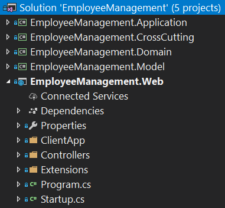
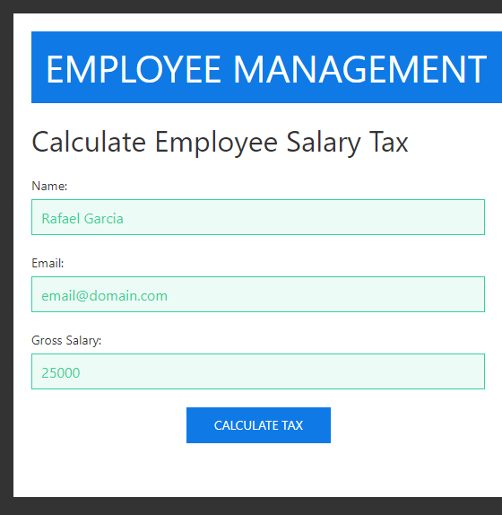
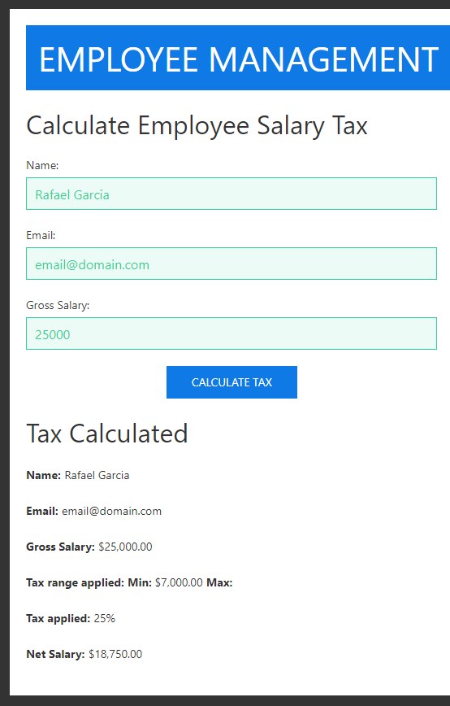

# Employee Management

Project to calculate the tax on the employee's salary. (SELECTION TEST)

## Best Practices and Technologies:

* Visual Studio 2017
* .NET Framework 4.7.1
* .NET Core 2.0
* C# 7.2
* ASP.NET Core 2.0
* Angular 5.2.9
* Typescript 2.7.2
* HTML5
* CSS3
* DDD (Domain-Driven Design)
* SOLID Principles
* Dependency Injection (Microsoft.Extensions.DependencyInjection)
* Design Patterns (Strategy)

## Business:

- Salary below 3000 is exempt from tax.
- Salary from 3000 to 5000 has 10% of tax.
- Salary from 5000 to 7000 has 15% of tax.
- Salary above 7000 has 25% tax.

## Screenshots:

